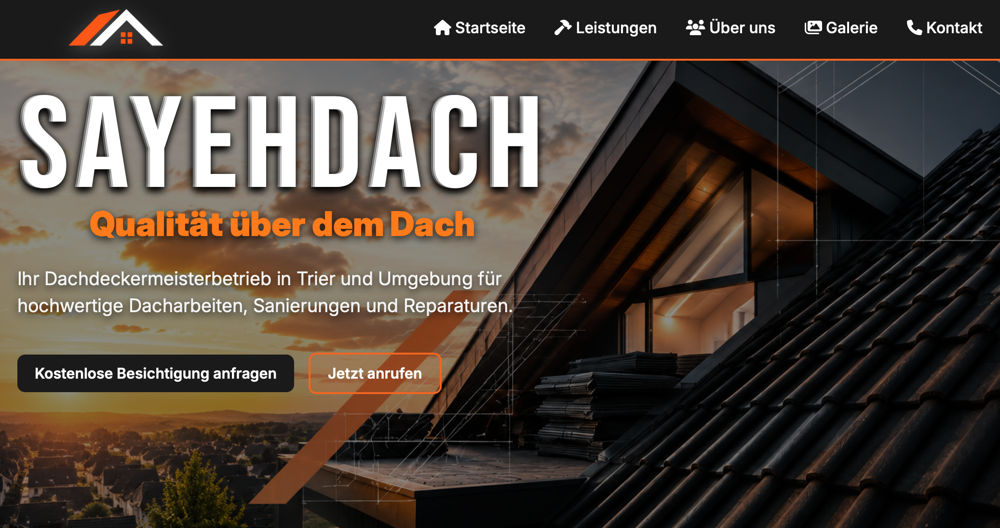
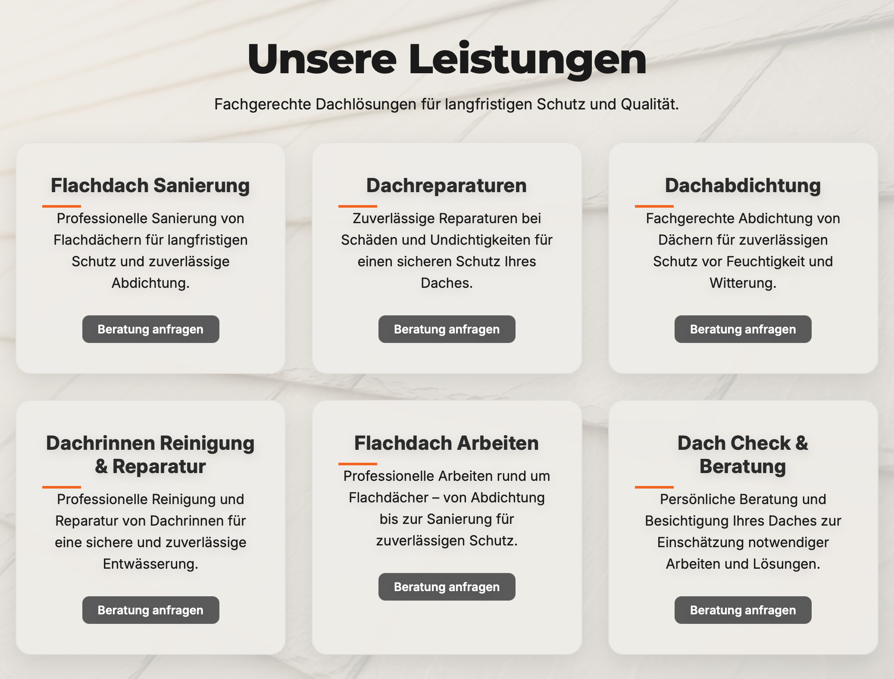
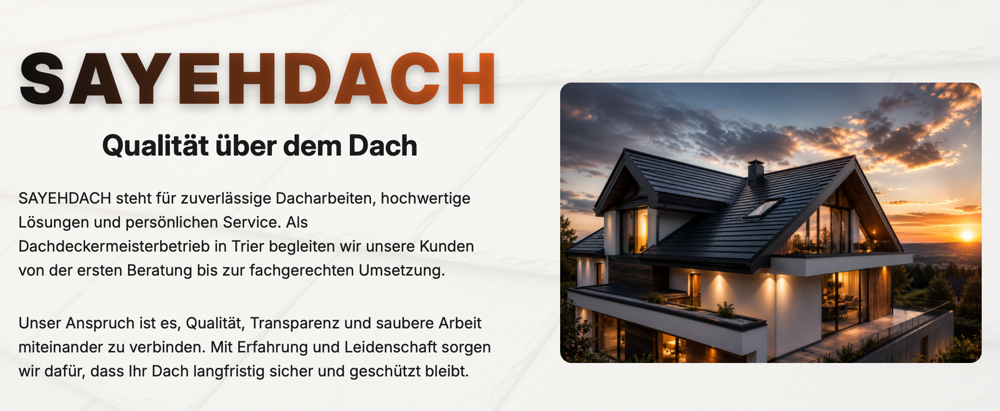
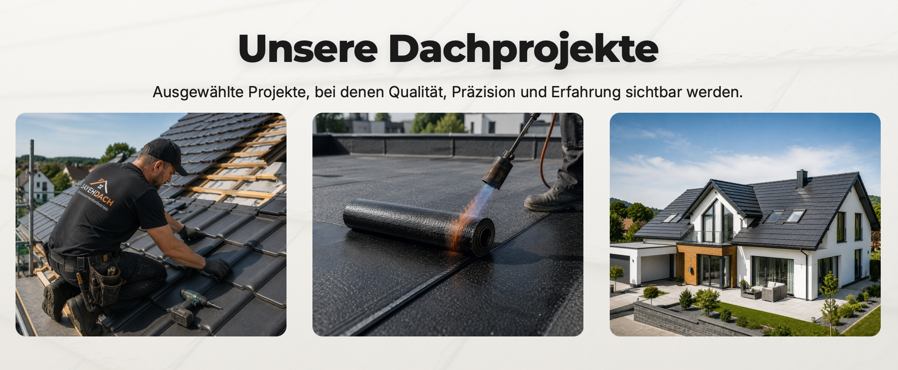
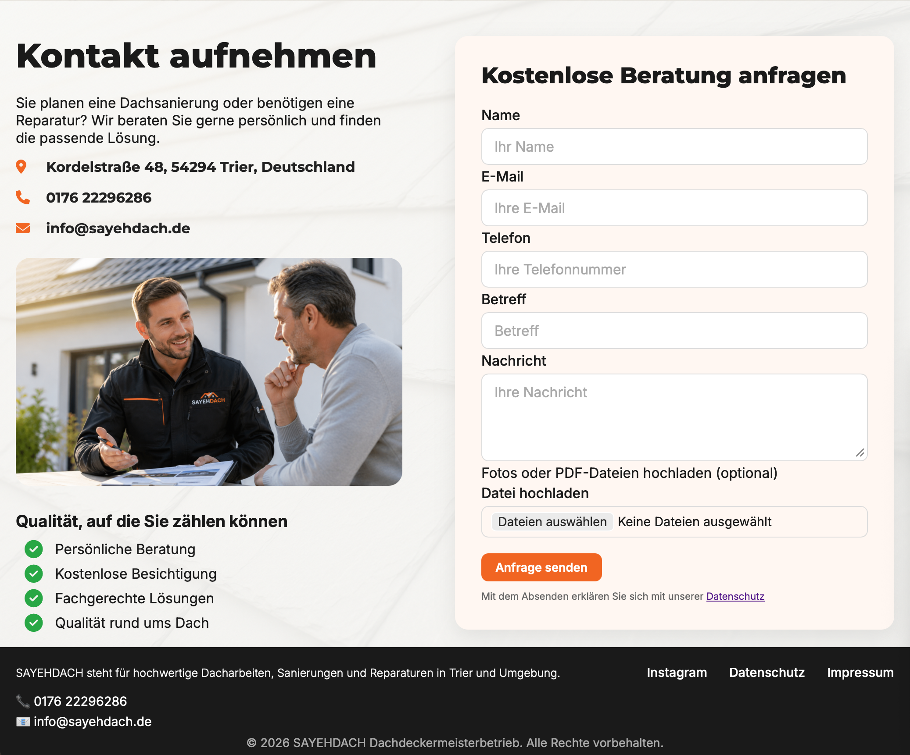
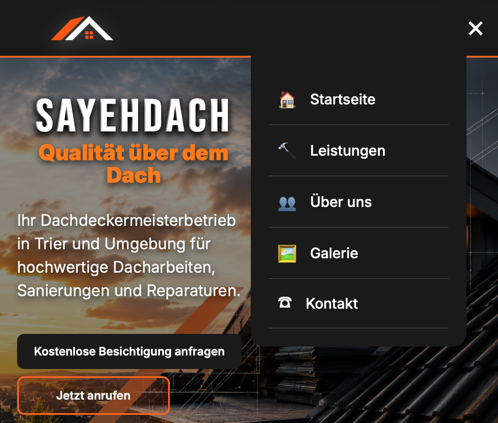

# SAYEHDACH Website

Professionelle Firmenwebsite für einen Dachdeckermeisterbetrieb in Trier.

Die Website wurde mit **Python Flask** entwickelt und bietet eine moderne,
responsive Darstellung mit Kontaktformular, Datei-Upload und automatischem
E-Mail-Versand.

---

## Features

- Responsive Design für Desktop, Tablet und Mobile
- Moderne Landingpage mit Hero-Bereich
- Leistungsübersicht für verschiedene Dacharbeiten
- Projektgalerie
- Kontaktformular mit:
  - Name
  - E-Mail
  - Telefon
  - Nachricht
  - Datei-Upload
- Automatischer E-Mail-Versand über SMTP
- Validierung von hochgeladenen Dateien
- Flash-Nachrichten für Benutzerfeedback
- Datenschutz-Seite
- Impressum-Seite
- Mobile Navigation mit JavaScript

---

## Technologien

### Backend

- Python
- Flask
- Jinja2

### Frontend

- HTML5
- CSS3
- JavaScript

### Weitere Technologien

- python-dotenv
- SMTP E-Mail Versand
- Logging
- Responsive Webdesign

---

## Projektstruktur

```
SAYEHDACH/
│
├── app.py
├── config.py
├── logging_config.py
│
├── routes/
│   └── contact.py
│
├── services/
│   └── email_service.py
│
├── utils/
│   └── file_validator.py
│
├── templates/
│   ├── base.html
│   ├── home.html
│   ├── datenschutz.html
│   └── impressum.html
│
├── static/
│   ├── css/
│   │   └── style.css
│   │
│   ├── js/
│   │   └── script.js
│   │
│   └── images/
│
├── requirements.txt
├── .gitignore
└── README.md
```

---

## Installation

Repository klonen:

```bash
git clone https://github.com/itsamirakbari/sayehdach-website.git
```

In das Projektverzeichnis wechseln:

```bash
cd sayehdach-website
```

Virtuelle Umgebung erstellen:

```bash
python -m venv venv
```

Virtuelle Umgebung aktivieren:

Windows:

```bash
venv\Scripts\activate
```

Linux / macOS:

```bash
source venv/bin/activate
```

Abhängigkeiten installieren:

```bash
pip install -r requirements.txt
```

---

## Konfiguration

Erstelle eine `.env` Datei im Hauptverzeichnis:

```env
SECRET_KEY=your_secret_key

DEBUG=False

MAIL_SERVER=smtp.example.com
MAIL_PORT=587
MAIL_USE_TLS=True

MAIL_USERNAME=your_email@example.com
MAIL_PASSWORD=your_password

MAIL_RECEIVER=receiver@example.com
```

---

## Anwendung starten

Starte die Flask-Anwendung:

```bash
python app.py
```

Danach ist die Website erreichbar unter:

```
http://127.0.0.1:5000
```

---

## Sicherheit

Das Projekt verwendet:

- Environment Variables für sensible Daten
- Sichere Dateinamen mit `secure_filename`
- Datei-Validierung
- Maximale Upload-Größe
- Logging statt `print()`

---

## Screenshots

### Desktop Ansicht











---

### Mobile Ansicht



---

## Autor

**Amir Akbari**

GitHub:
https://github.com/itsamirakbari